# Notificaciones automáticas

Esta sección explica cómo preparar notificaciones automáticas desde scripts de Bash, pipelines o análisis largos. La idea es recibir avisos cuando un proceso inicia, termina correctamente o falla.

::: callout-important
## Tokens y webhooks son secretos

Un token de Telegram o una URL de webhook de Discord funcionan como una contraseña. No los compartas, no los pegues en documentos públicos y no los subas a GitHub.
:::

## Mensajes a Telegram

### Crear un bot en Telegram

1.  Busca @BotFather y abre el chat.

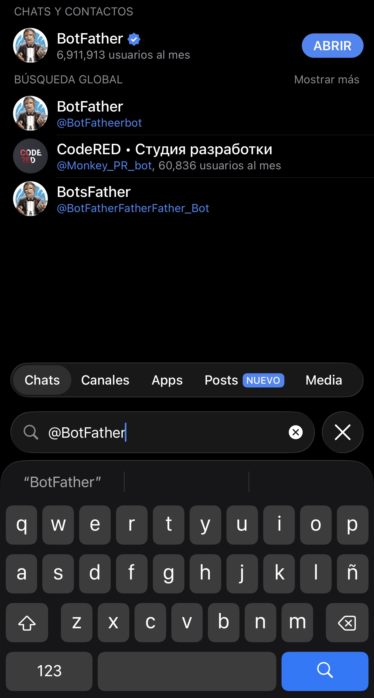{fig-align="center" width="350"}

2.  Crea un nuevo bot.

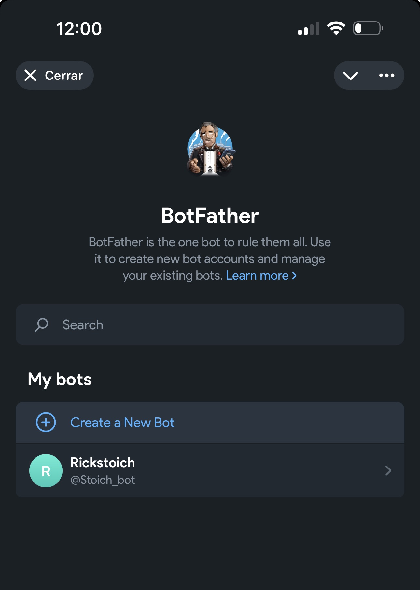{fig-align="center" width="350"}

3.  Ponle un **nombre al bot** y elige un **nombre de usuario** que termine en `bot`. El `username` debe estar disponible.

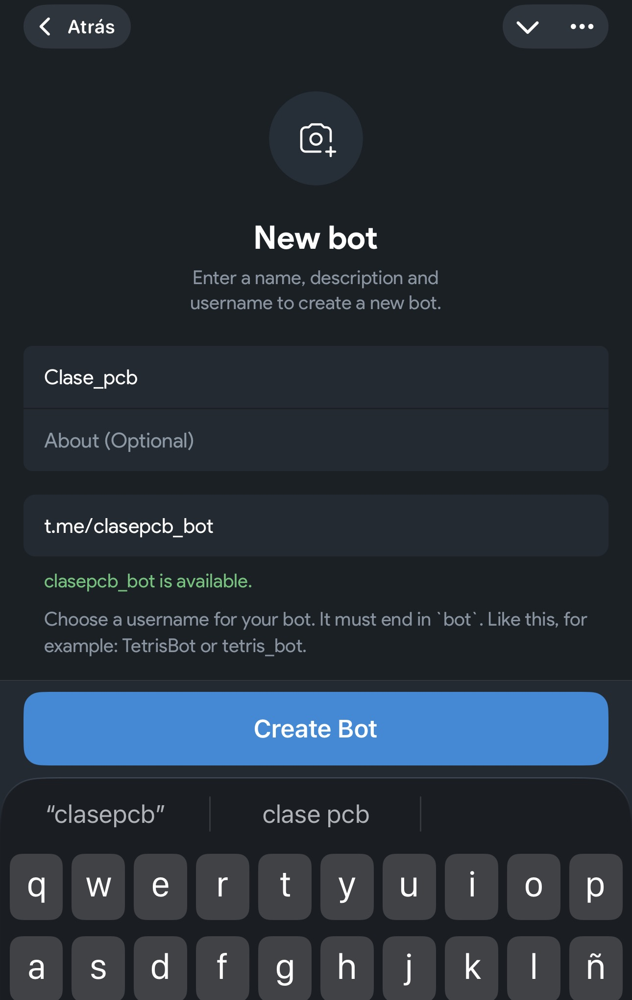{fig-align="center" width="350"}

4.  BotFather te dará un **token**.

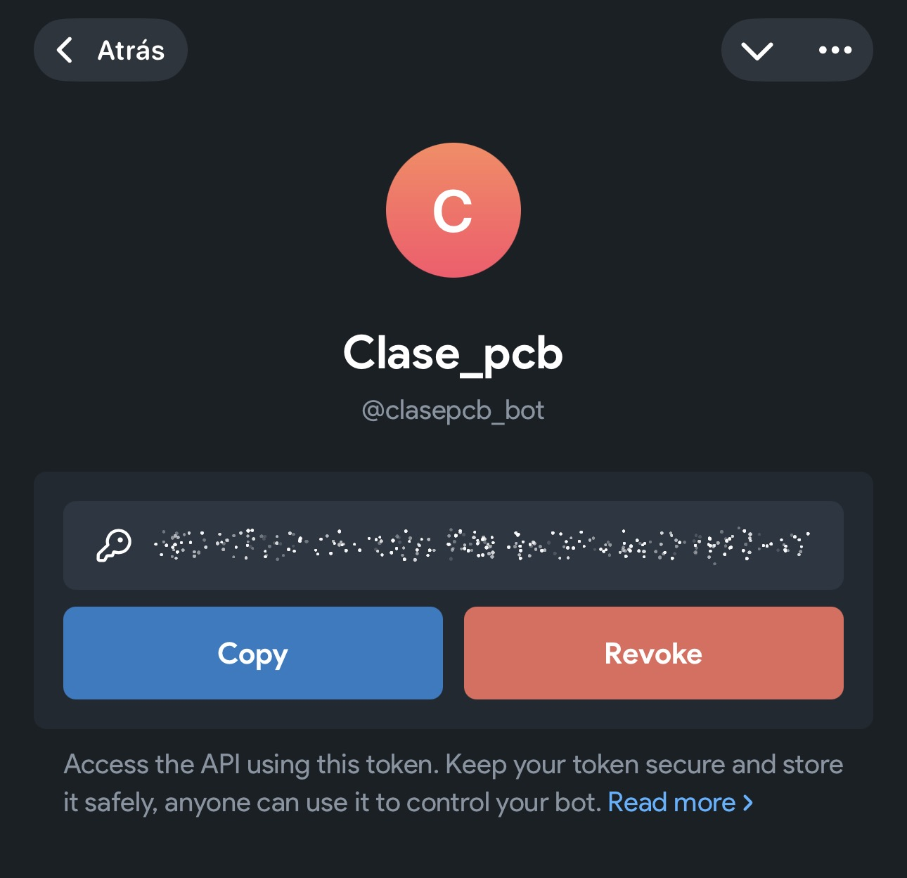{fig-align="center" width="350"}

✅ Ese token es tu contraseña del bot. **No lo compartas.**

5.  Abre el chat con tu bot, buscándolo por su `username`.

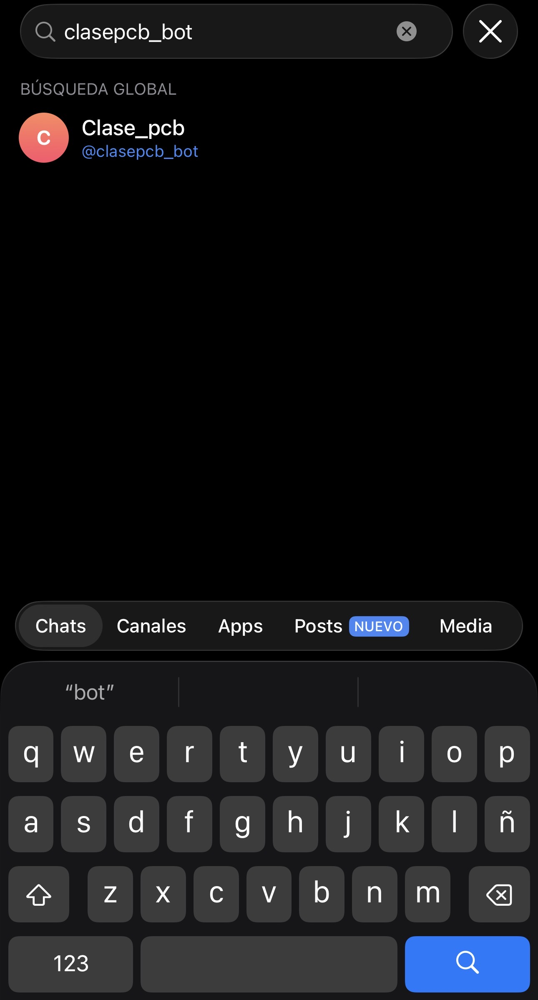{fig-align="center" width="350"}

6.  Presiona **Iniciar**.

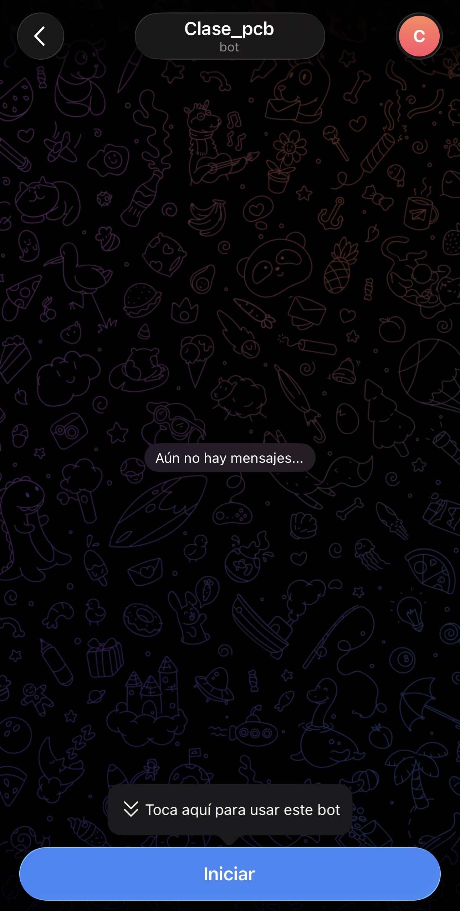{fig-align="center" width="350"}

## Conseguir tu `chat_id`

Define temporalmente el token de tu bot:

``` bash
TELEGRAM_BOT_TOKEN="TU_TOKEN_AQUI"
```

Después consulta las actualizaciones del bot:

``` bash
curl -s "https://api.telegram.org/bot${TELEGRAM_BOT_TOKEN}/getUpdates"
```

Busca en la salida una sección parecida a esta:

``` json
"chat":{"id":123456789,"first_name":"Pedro"}
```

El número que aparece en `id` es tu `TELEGRAM_CHAT_ID`.

::: callout-note
## Si no aparece tu `chat_id`

Primero escribe cualquier mensaje en el chat de tu bot y vuelve a ejecutar el comando `getUpdates`.
:::

## Enviar un mensaje con `curl`

``` bash
TELEGRAM_BOT_TOKEN="TU_TOKEN_AQUI"
TELEGRAM_CHAT_ID="TU_CHAT_ID_AQUI"

curl -s -X POST "https://api.telegram.org/bot${TELEGRAM_BOT_TOKEN}/sendMessage" \
  -d "chat_id=${TELEGRAM_CHAT_ID}" \
  -d "text=Hola 👋 Mensaje enviado desde Bash"
```

## Guardar credenciales en un archivo `.env`

Crea un archivo `.env` fuera del repositorio del proyecto, o agrégalo al archivo `.gitignore`.

``` bash
nano .env
```

Contenido recomendado:

``` bash
TELEGRAM_BOT_TOKEN="TU_TOKEN_AQUI"
TELEGRAM_CHAT_ID="TU_CHAT_ID_AQUI"
```

Protege el archivo para que solo tu usuario pueda leerlo:

``` bash
chmod 600 .env
```

Si el archivo `.env` está dentro de un proyecto con Git, agrégalo a `.gitignore`:

``` bash
nano .gitignore
```

Agrega esta línea:

``` text
.env
```

## Función reusable `tg_send`

Carga primero las variables del archivo `.env`:

``` bash
source .env
```

Después define la función:

``` bash
tg_send () {
  local msg="$1"

  curl -s -X POST "https://api.telegram.org/bot${TELEGRAM_BOT_TOKEN}/sendMessage" \
    -d "chat_id=${TELEGRAM_CHAT_ID}" \
    -d "text=${msg}" \
    -d "disable_web_page_preview=true" > /dev/null
}
```

Uso:

``` bash
tg_send "✅ Pipeline terminado correctamente."
```

## Usar Telegram en un script de Bash

El siguiente patrón permite enviar una notificación al iniciar y otra al terminar un proceso.

``` bash
#!/usr/bin/env bash
set -euo pipefail

source /ruta/a/tu/.env

tg_send () {
  local msg="$1"

  curl -s -X POST "https://api.telegram.org/bot${TELEGRAM_BOT_TOKEN}/sendMessage" \
    -d "chat_id=${TELEGRAM_CHAT_ID}" \
    -d "text=${msg}" \
    -d "disable_web_page_preview=true" > /dev/null
}

tg_send "🚀 Inició el análisis"

if comando_largo; then
  tg_send "✅ El análisis terminó correctamente"
else
  tg_send "❌ El análisis terminó con error"
  exit 1
fi
```

## Mensajes a Discord

Discord puede utilizarse para recibir notificaciones automáticas desde scripts de Bash. Para este uso no es necesario crear un bot completo: lo más práctico es usar **webhooks**.

Un **webhook** es una URL especial asociada a un canal de Discord. Cuando un script envía un mensaje a esa URL, el mensaje aparece automáticamente en ese canal.

::: callout-tip
## Recomendación para BEAGLE

Usa **un webhook por canal** para mantener las notificaciones ordenadas.

| Canal de Discord | Uso sugerido                                        |
|------------------|-----------------------------------------------------|
| `#pruebas`       | Probar mensajes antes de usarlos en análisis reales |
| `#beast`         | Notificaciones de análisis de BEAST/BEAST2          |
| `#cpu`           | Análisis generales con CPU                          |
| `#gpu`           | Análisis que usan GPU                               |
| `#errores`       | Mensajes cuando un proceso falla                    |
:::

En Discord, crea un servidor nuevo para organizar los canales de notificación.

1.  Selecciona **Crear mi propio modelo**.

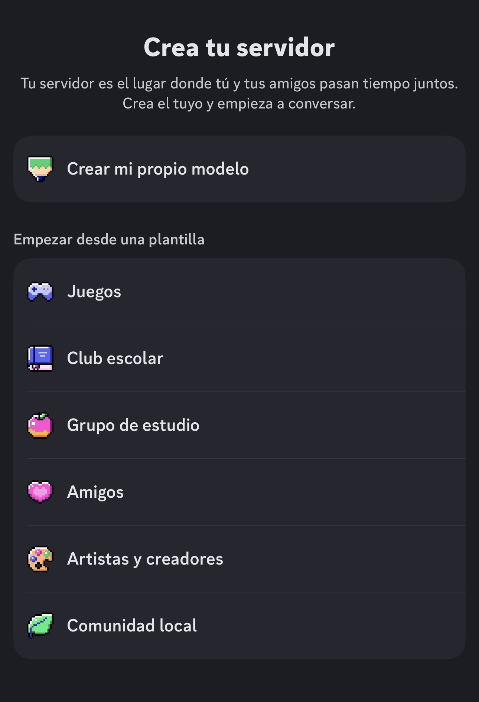{fig-align="center" width="350"}

2.  Discord puede preguntar si el servidor será para una comunidad o para amigos. Para un grupo de trabajo, curso o laboratorio, puedes elegir **Para un club o una comunidad**. También puedes omitir esta pregunta.

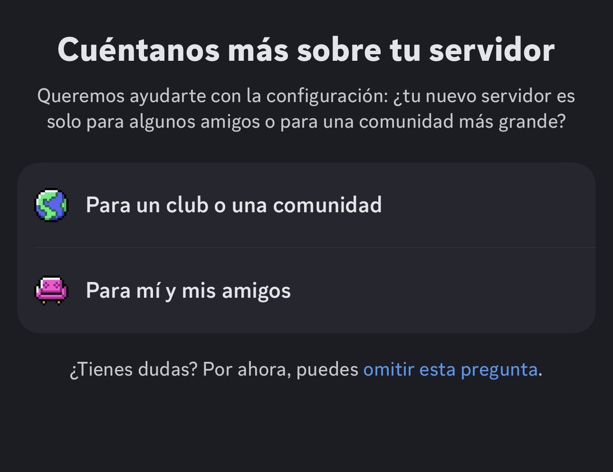{fig-align="center" width="350"}

3.  Asigna un nombre al servidor. En este ejemplo se usa `UniSSE`.

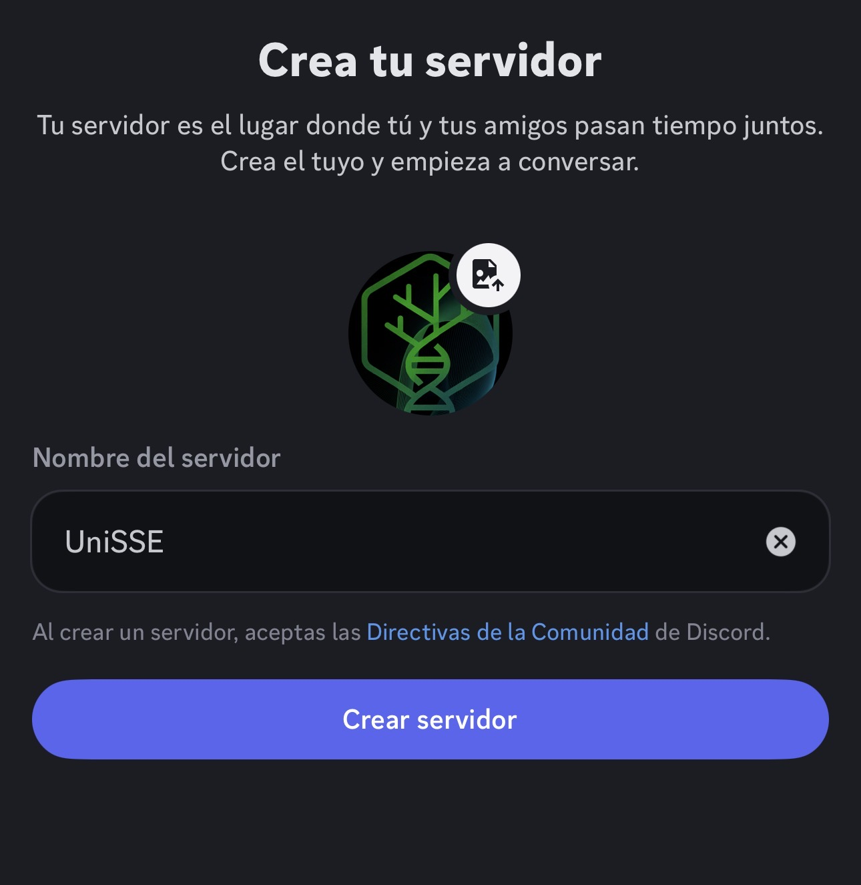{fig-align="center" width="350"}

4.  Discord puede mostrar una pantalla para invitar personas. Puedes copiar el enlace, compartirlo o cerrar esta pantalla y continuar configurando el servidor.

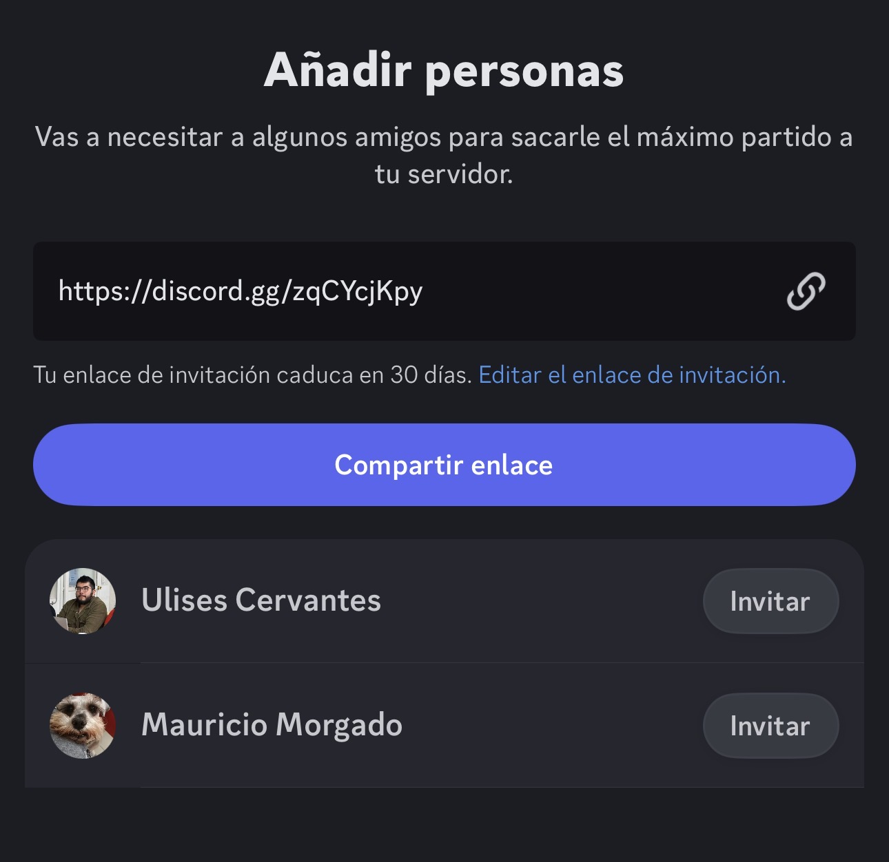{fig-align="center" width="350"}

5.  Una vez creado el servidor, verás los canales disponibles. En este ejemplo se crearon canales como `#pruebas` y `#beast`.

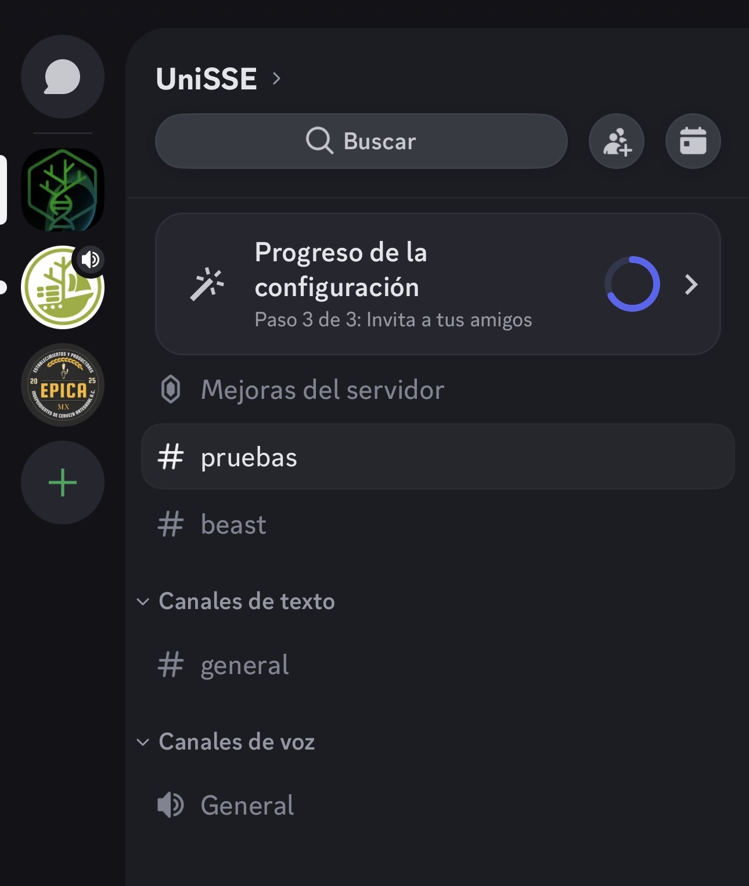{fig-align="center" width="350"}

## Crear canales

Para crear canales desde la aplicación móvil:

1.  Abre el menú del servidor.
2.  Selecciona **Más opciones**.

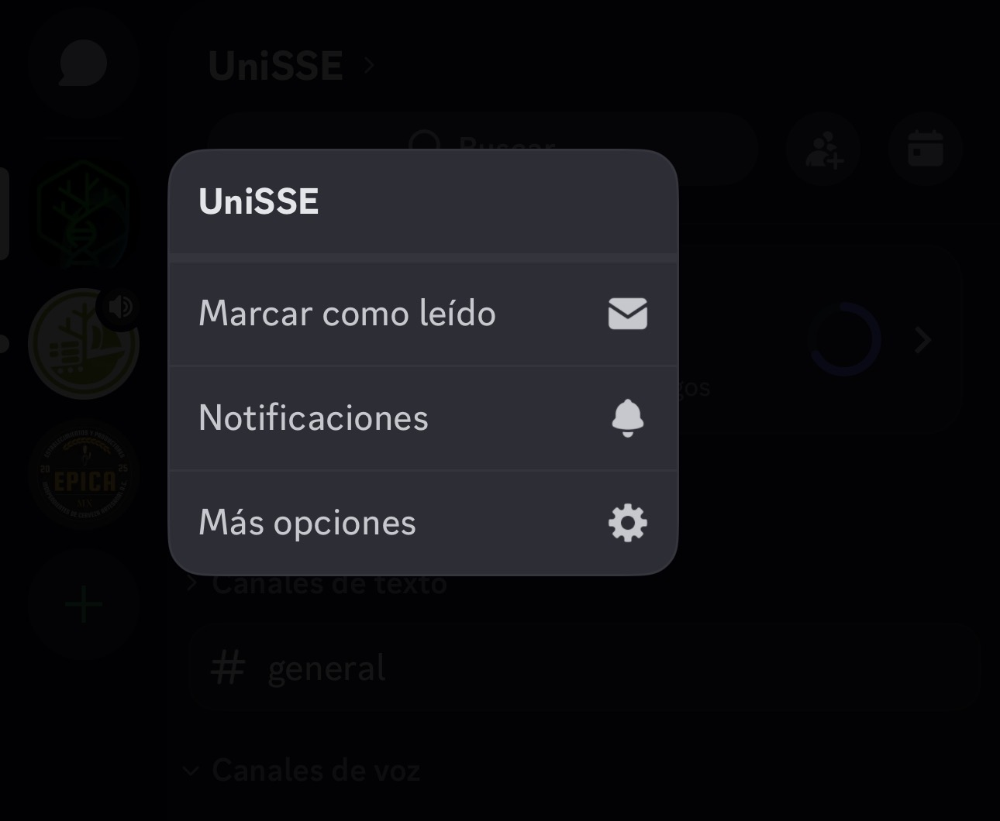{fig-align="center" width="350"}

3.  Selecciona **Crear un canal**.

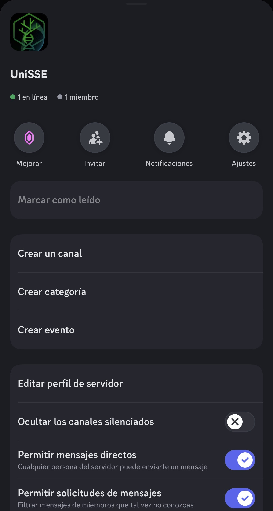{fig-align="center" width="350"}

Puedes crear canales separados para diferentes tipos de análisis:

``` text
#pruebas
#beast
#cpu
#gpu
#errores
```

::: callout-note
## ¿Por qué varios canales?

Separar los mensajes ayuda a evitar ruido. Los análisis de prueba pueden llegar a `#pruebas`, los análisis con GPU a `#gpu` y los errores a `#errores`.
:::

## Crear un webhook para un canal

::: callout-warning
## Los webhooks no se crean desde la app móvil

En la app móvil de Discord puede aparecer el apartado de **Webhooks**, pero Discord indica que, por ahora, los webhooks solo se pueden crear desde la **aplicación de escritorio** o desde Discord en la **web**.

Para crear y copiar la URL del webhook, usa una computadora o entra a Discord desde el navegador.
:::

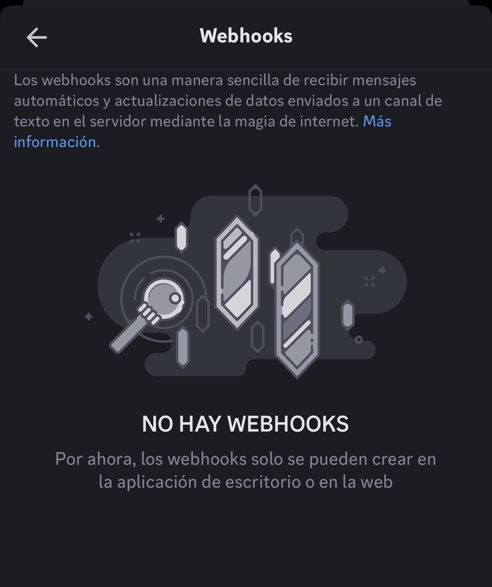{fig-align="center" width="350"}

### Desde Discord de escritorio o navegador

1.  Entra al servidor y selecciona el canal donde quieres recibir mensajes, por ejemplo `#pruebas`.

2.  Coloca el cursor sobre el canal y selecciona el ícono de engrane para abrir la configuración del canal.

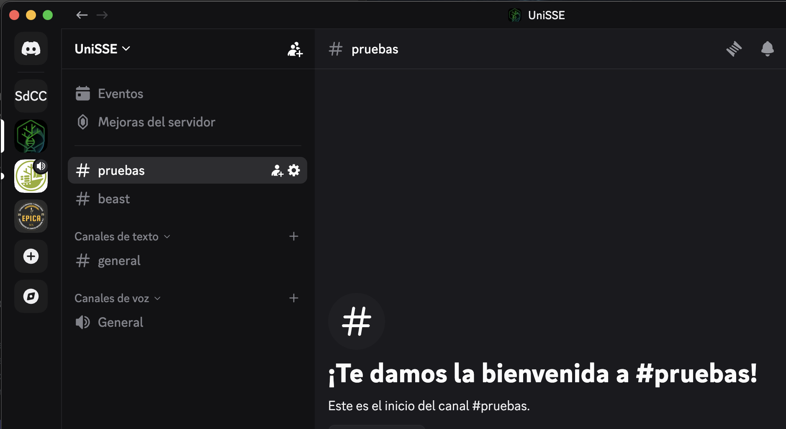{fig-align="center" width="650"}

3.  En la configuración del canal, entra a **Integraciones**.

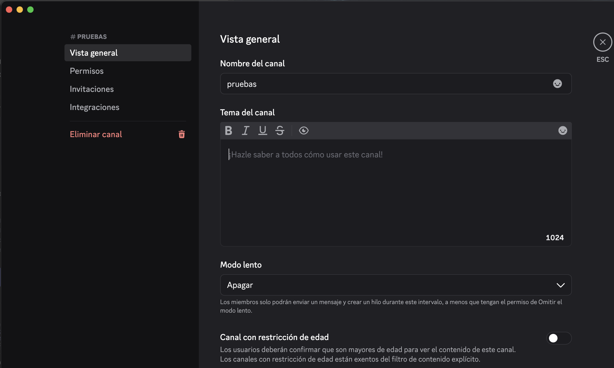{fig-align="center" width="650"}

4.  En **Integraciones**, selecciona **Crear Webhook**.

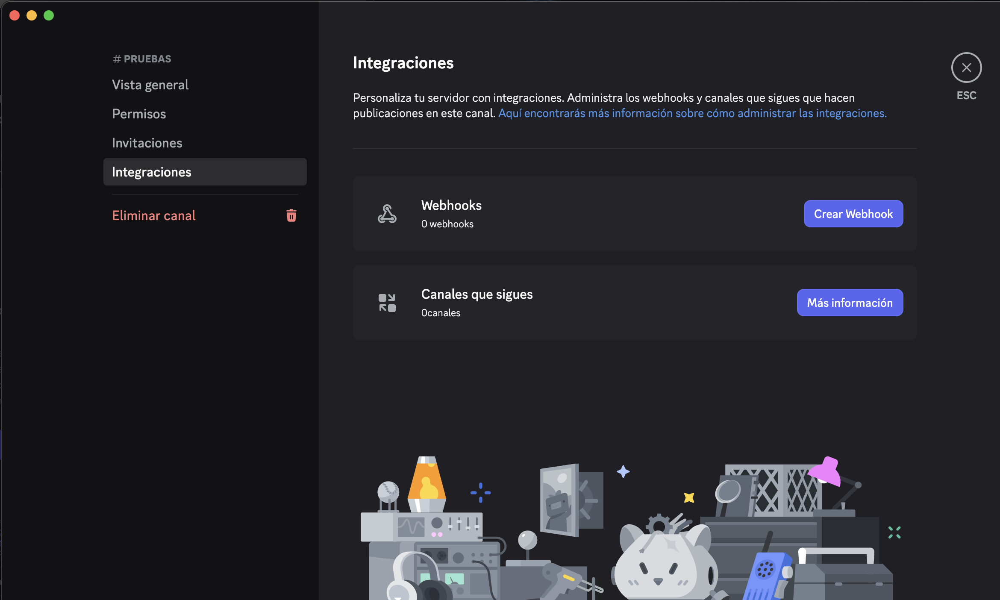{fig-align="center" width="650"}

5.  Discord creará un webhook. Puedes cambiarle el nombre, seleccionar el canal y copiar la URL.

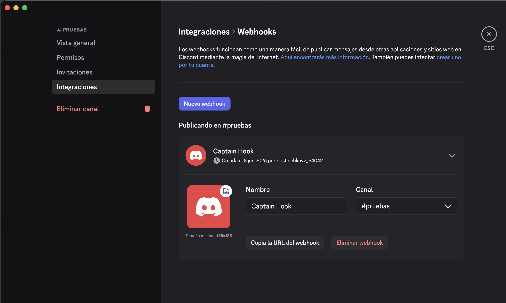{fig-align="center" width="650"}

6.  Puedes crear más webhooks. En este ejemplo se creó un webhook llamado `beagle`.

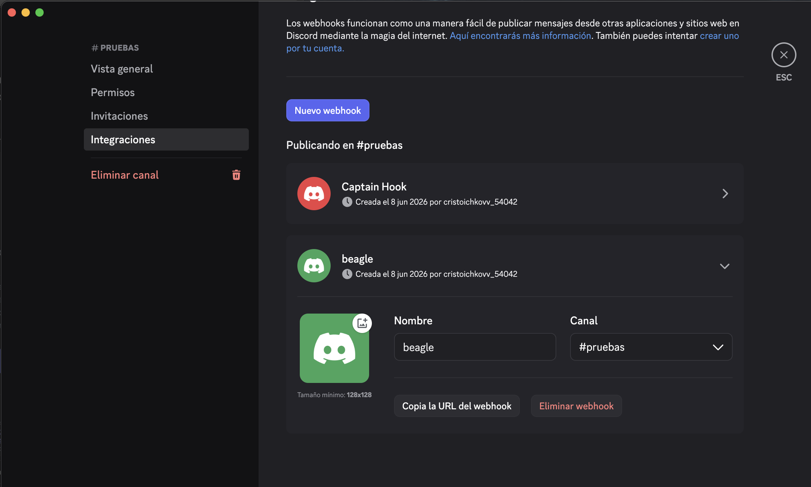{fig-align="center" width="650"}

::: callout-important
## No compartas la URL del webhook

La URL del webhook funciona como una contraseña. Cualquier persona con esa URL puede enviar mensajes al canal.

No la compartas, no la pegues en documentos públicos y no la subas a GitHub.
:::

## Guardar los webhooks en un archivo `.env`

Crea un archivo `.env` para guardar las URLs de los webhooks.

``` bash
nano .env
```

Contenido recomendado:

``` bash
DISCORD_WEBHOOK_PRUEBAS="https://discord.com/api/webhooks/XXXX/YYYY"
DISCORD_WEBHOOK_BEAST="https://discord.com/api/webhooks/XXXX/YYYY"
DISCORD_WEBHOOK_CPU="https://discord.com/api/webhooks/XXXX/YYYY"
DISCORD_WEBHOOK_GPU="https://discord.com/api/webhooks/XXXX/YYYY"
DISCORD_WEBHOOK_ERRORES="https://discord.com/api/webhooks/XXXX/YYYY"
```

Dale permisos restringidos al archivo:

``` bash
chmod 600 .env
```

Si el archivo `.env` está dentro de un proyecto con Git, agrégalo al archivo `.gitignore`:

``` bash
nano .gitignore
```

Agrega:

``` text
.env
```

## Probar un webhook con `curl`

Primero carga las variables del archivo `.env`:

``` bash
source .env
```

Después envía un mensaje de prueba:

``` bash
curl -s -H "Content-Type: application/json" \
  -X POST \
  -d '{"content":"Hola 👋 mensaje enviado desde Bash"}' \
  "$DISCORD_WEBHOOK_PRUEBAS"
```

Si todo está bien configurado, el mensaje aparecerá en el canal de Discord asociado a ese webhook.

## Función reusable `discord_send`

Para reutilizar el envío de mensajes en varios scripts, puedes definir una función de Bash:

``` bash
discord_send () {
  local webhook="$1"
  local msg="$2"

  payload=$(python3 -c 'import json,sys; print(json.dumps({"content": sys.argv[1]}, ensure_ascii=False))' "$msg")

  curl -s -H "Content-Type: application/json" \
    -X POST \
    -d "$payload" \
    "$webhook" > /dev/null
}
```

Uso:

``` bash
source .env

discord_send "$DISCORD_WEBHOOK_PRUEBAS" "✅ Mensaje enviado desde Bash"
```

## Usar Discord en un script de Bash

El siguiente patrón envía un mensaje cuando inicia un proceso y otro cuando termina. Si el proceso falla, manda el aviso al canal de errores.

``` bash
#!/usr/bin/env bash
set -euo pipefail

source /ruta/a/tu/.env

discord_send () {
  local webhook="$1"
  local msg="$2"

  payload=$(python3 -c 'import json,sys; print(json.dumps({"content": sys.argv[1]}, ensure_ascii=False))' "$msg")

  curl -s -H "Content-Type: application/json" \
    -X POST \
    -d "$payload" \
    "$webhook" > /dev/null
}

on_exit () {
  status=$?

  if [ "$status" -eq 0 ]; then
    discord_send "$DISCORD_WEBHOOK_PRUEBAS" "✅ El análisis terminó correctamente"
  else
    discord_send "${DISCORD_WEBHOOK_ERRORES:-$DISCORD_WEBHOOK_PRUEBAS}" "❌ El análisis terminó con error"
  fi
}

trap on_exit EXIT

discord_send "$DISCORD_WEBHOOK_PRUEBAS" "🚀 Inició el análisis"

comando_largo
```

## Mensajes para análisis específicos

Si tienes un canal específico para BEAST, puedes enviar los mensajes a ese canal:

``` bash
discord_send "$DISCORD_WEBHOOK_BEAST" "🧬 Inició análisis de BEAST"
```

Y en caso de error, usar el canal de errores:

``` bash
discord_send "$DISCORD_WEBHOOK_ERRORES" "⚠️ Falló el análisis de BEAST"
```

Para análisis que usan GPU, puedes usar un webhook específico:

``` bash
discord_send "$DISCORD_WEBHOOK_GPU" "🚀 Inició análisis con GPU"
```

Al finalizar:

``` bash
discord_send "$DISCORD_WEBHOOK_GPU" "✅ Terminó análisis con GPU"
```

## ¿Qué hacer si se filtró una URL de webhook?

Si accidentalmente compartiste una URL de webhook o la subiste a GitHub:

1.  Entra a Discord.
2.  Abre la configuración del canal.
3.  Ve a **Integraciones**.
4.  Entra a **Webhooks**.
5.  Elimina el webhook comprometido.
6.  Crea un webhook nuevo.
7.  Actualiza tu archivo `.env`.

::: callout-warning
## Importante

No basta con borrar la URL del repositorio si ya fue publicada. Lo más seguro es eliminar ese webhook y crear uno nuevo.
:::
